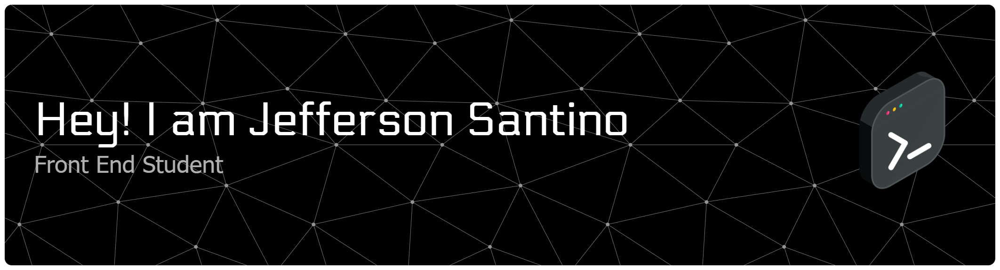

## 🚀 About Me

I am currently pursuing a career in Front-End Development, focusing on mastering HTML, CSS, and JavaScript. My goal is to create responsive, user-friendly, and visually engaging web applications while continuously improving my programming skills.

## 🌐 Connect with Me

&nbsp;&nbsp;&nbsp;&nbsp;&nbsp;&nbsp;&nbsp;&nbsp;&nbsp;

## 🛠️ Skills & Technologies

### 💻 Programming Languages

&nbsp;&nbsp;&nbsp;

### 💻 Frontend Development

&nbsp;&nbsp;&nbsp;

### 💻 Mobile App Development

## 📊 GitHub Stats & Activity

---

### 🎯 "Code is like humor. When you have to explain it, it's bad." – Cory House

**Thank you for visiting my profile! 😊**

